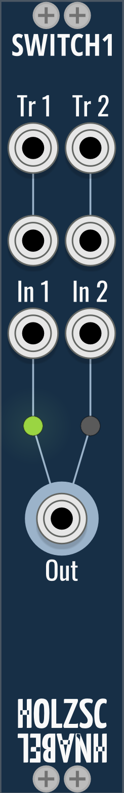
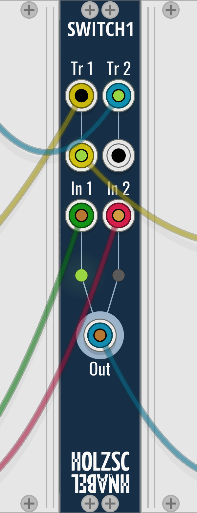
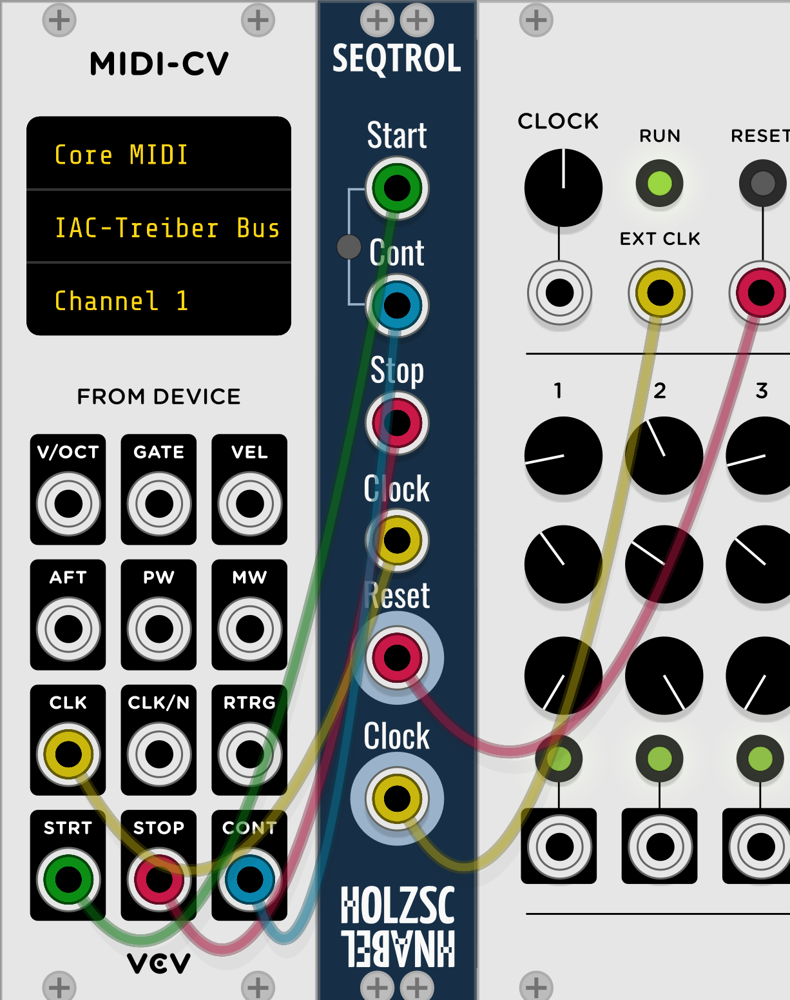

# Holzschnabel Modules

Modules for VCV Rack

I don’t know, somehow I felt the urge to start a new plugin for VCV Rack mainly because the GoodSheperd modules need an overhaul and I wanted to start on a clean slate.

* Switch1: bistable switch with separate trigger inputs for each state.
* Seqtrol: forces SEQ3 and many other sequencers to play the first note on MIDI START instead of skipping it. Use the MIDI clock **(not the CLK/N clock)** and choose the divisor from Seqtrol’s context menu! Have a look at [RCM SEQ Adapter](https://github.com/Rcomian/rcm-modules/blob/v1/README.md#seq-adapter) if you want this functionality for an internal clock.

## Switch1

A non-toggling latching 2:1 switch. You can select one out of two input signals to be forwarded to the output. With a trigger pulse on a trigger input the respective input can be selected.

### Inputs

**Tr 1 (2x)/Tr 2 (2x):** Two trigger inputs for each In (OR-linked). A rising edge triggers. If Trigger 1 and Trigger 2 are fired simulataneously, Input 1 always wins.

**In 1/2:** Signal inputs.

### Outputs

**Out:** Switch output.

 

### Typical wiring

 

## Sectrol

### Inputs

**Start:** Connect with the *Start* output of your MIDI module. A trigger signal sends a reset and forwards the clock to the *Clock* output.

**Cont:** Connect with the *Continue* output of your MIDI module. A trigger signal forwards the clock to the *Clock* output.

**Stop:** Connect with the *Stop* output of your MIDI module.  A trigger signal stops the clock at the *Clock* output.

**Clock:** Connect with the *Clock* output of your MIDI module. Use the raw clock here, do not use the Clock Divider from the MIDI module! See [Context Menu](#context-menu).

### Outputs

**Reset:** Connect with the *Reset* input of your sequencer module.

**Clock:** Connect with the *Clock* input of your sequencer module.

### Context Menu

**Clock divisor:** Set the note value of the *Clock* Output. There are 96 MIDI clock ticks per whole note.

 

### Typical wiring

 
